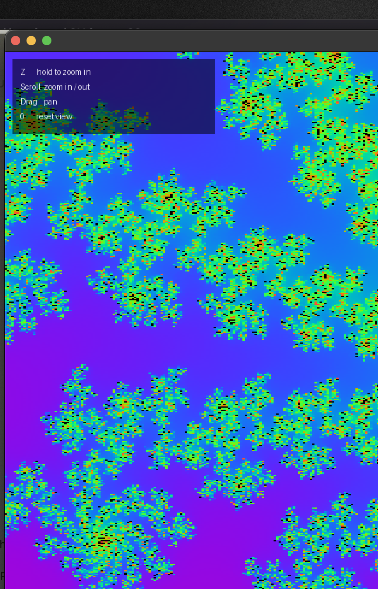

# vibe-fractals

A super quick exploration of generating fractals with Claude. Spent an evening vibe-coding fractal renderers — tried XaoS (broken on modern macOS), a Python one-liner ASCII Mandelbrot, a GLSL shader via glslViewer, and landed on a proper GPU-accelerated interactive Mandelbrot viewer.

## What's here

- `fractal.py` — interactive Mandelbrot viewer using moderngl (OpenGL via Python)
- `mandelbrot.frag` — GLSL fragment shader for glslViewer (earlier experiment)

## Setup

```bash
pip3 install moderngl moderngl-window
```

## Run

```bash
python3 fractal.py
```

## Controls

| Input | Action |
|---|---|
| `Z` (hold) | Zoom in toward cursor |
| `Shift+Z` (hold) | Zoom out |
| Scroll | Zoom in / out |
| Drag | Pan |
| `0` | Reset view |

## Future work

### Going deeper: beyond float32

The viewer currently breaks into large colored blocks around **1×10⁷ magnification** — this is float32 running out of precision, not an iteration count problem. Here's how serious explorers solve it:

**Perturbation theory** — the big one, used by Kalles Fraktaler, Mandel Machine, and others. Instead of computing a full high-iteration orbit at full precision for every pixel, you compute *one* reference orbit at the center of the view using arbitrary precision arithmetic (slow, CPU, done once per frame). Every other pixel is then computed as a tiny perturbation from that reference using regular float64. This gives essentially unlimited depth at GPU speeds.

**Series approximation (BLA/SA)** — layered on top of perturbation theory. Fits a polynomial to the early iterations (which look identical across the whole image at deep zoom) and skips thousands of iterations per pixel for free. Kalles Fraktaler uses this to stay interactive at 10¹³× zoom.

**Double-double arithmetic** — emulates 128-bit floats by carrying error in a second float (`hi + lo` pairs). Doable in a shader, gives ~30 decimal digits vs float32's ~7. Simpler to implement than perturbation theory but only extends the limit to ~10¹⁴×.

**Arbitrary precision (slow path)** — Python's `decimal` or GNU MP on the CPU. Accurate to any depth but renders one frame every several seconds at extreme zoom. Ultra Fractal uses this for high-quality still renders.

The pragmatic modern approach is **perturbation theory + series approximation** — it's why Kalles Fraktaler can zoom to 10²⁰⁰× in real time. That would be the natural next step for this project.

## Precision limit

The viewer uses 32-bit floats (float32) for all GPU math. Iteration count scales dynamically with zoom depth, but float32 runs out of precision around **1×10⁷ magnification** — at that point adjacent pixels map to the same coordinate value and the image breaks into large colored blocks. Going deeper requires either double-precision emulation or perturbation theory (see powerful explorers like Kalles Fraktaler or Ultra Fractal).

## Preview


